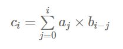
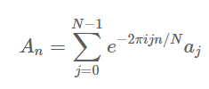
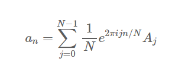

---
title: "FFT(Fast Fourier Transform) 알고리즘"
date: "2020-05-10"
author: "Jongwon"
---


#### FFT(Fast Fourier Transform) 알고리즘                                                   201601726_이종원

---

FFT는 이산푸리에변환 DFT(Discrete Fourier Transform)와 그 역변환을 빠르게  수행하는 알고리즘으로 알려져 있습니다.  주기적으로 반복되는 연산을 생략하여 속도를 빠르게 향상시킬수 있기 때문에, 시간 제한과 메모리 제한  내에서 문제를 해결해야 할 때(PS에서) 종종 사용되는 알고리즘입니다.

먼저 푸리에 변환을 잠시 짚고 넘어가자면 푸리에 변환은 음성,통신,신호처리 등 여러분야에서 중요한 개념이며 매우 유용하게 응용됩니다. 

아래의 링크를 통하여 푸리에 변환을 시각적으로 접근할 수 있었습니다. 

[*3Blue1Brown Fourier transform 참고](https://www.youtube.com/watch?v=spUNpyF58BY&t=322s)

간단히 정리해보면 푸리에 변환은 임의의 입력 신호를 다양한 주파수를 갖는 주기함수들의 합으로 분해하여 표현하는 것 입니다. 이때 표현되는 주기함수는 sin, cos 삼각함수 입니다. 


**<DFT와 FFT의 이해>**

---

 예를 들어 수열 a,b가 있고 이 수열들을 DFT로 변환시킨 수열 A,B가 있습니다. 그리고 수열 A,B의 단순곱(pointwise product)의 결과인 수열 C가 있고, 수열 a,b의 합성곱(convolution)의 결과인 수열 c가 있습니다.

그런데,  수열 C를 IDFT로 변환시키면 수열c가 나오게 됩니다.


a,b의 합성곱과 A,B의 단순곱이 서로 대응되는 관계에 있다는 사실이 밝혀졌고, 이때 사용된 변환이 DFT와 IDFT입니다. 그리고 DFT를 빠르게 계산하는 방법이 FFT입니다.  FFT는 DFT의 계산과정에서 대칭성과 주기성을 사용하여 연산량을 줄이는 변환입니다.

빨간색 선으로 표현된 루트가 더 복잡해 보이지만 실제로는 회색 루트보다 더 빠른 루트 입니다.

convolution은  크기가 n인 배열 a,b가 있다고 했을때, 아래와 같은 식으로 계산된 c입니다.



convolution으로 C를 계산할때 시간복잡도는 n^2이지만, FFT를 사용하여 계산할시 시간복잡도는 NlogN 입니다.

#### <공식의 정의와 변환>

---


              

​                       (DFT)                                                                    (IDFT)


* 위의 식들은 주기가 N인 수열의 DFT와 IDFT계산시 사용하는 식입니다.

* 오일러 공식  을 생각해보면 이 수열들이 sin, cos 주기함수들의 합으로 표현된 것을 알 수 있습니다.

 

* 위의 식은 DFT식을 변환시킨 것인데, 각각 짝수번째 항의 DFT와 홀수번째 항의 DFT로 분리시켜 놓은 것 입니다. (FFT 계산에 활용)


**<문제에 활용>**

---


* 개념만 봐서는 잘 이해가 되지 않아서 예제 문제를 찾아서 어떻게 활용할지 생각해 보았습니다.

* **문제**: N개의 수가 있는 X와 Y가 있다. 이때 X나 Y를 순환 이동시킬 수 있다. 순환 이동이란 마지막 원소를 제거하고 그 수를 맨 앞으로 다시 삽입하는 것을 말한다. 예를 들어, {1, 2, 3}을 순환 이동시키면 {3, 1, 2}가 될 것이고, {3, 1, 2}는 {2, 3, 1}이 된다. 순환 이동은 0번 또는 그 이상 할 수 있다. 이 모든 순환 이동을 한 후에 점수를 구하면 된다. 점수 S는 다음과 같이 구한다.

  S = X[0]*Y[0] + X[1]*Y[1] + ... + X[N-1]*Y[N-1]

  이때 S를 최대로 하면 된다.

**<DFT와 FFT 연산횟수 비교>**

---


**(위의 표는 DFT와 FFT 연산시 필요한 복소수의 연산 횟수를 나타낸 표입니다.)**

그냥 표를 봐도 FFT의 속도가 훨씬 빠를 것이라는 것을 직감적으로 알 수 있었습니다.


#### <코드>

---

```java
import static java.lang.Math.*;
 
public class Main {

    public static int bitReverse(int n, int bits) {
        int reversedN = n;
        int count = bits - 1;
 
        n >>= 1;
        while (n > 0) {
            reversedN = (reversedN << 1) | (n & 1);
            count--;
            n >>= 1;
        }
 
        return ((reversedN << count) & ((1 << bits) - 1));
    }
 //reverse
    
    static void fft(Complex[] buffer) {
 
        int bits = (int) (log(buffer.length) / log(2));
        for (int j = 1; j < buffer.length / 2; j++) {
 
            int swapPos = bitReverse(j, bits);
            Complex temp = buffer[j];
            buffer[j] = buffer[swapPos];
            buffer[swapPos] = temp;
        }
 
        for (int N = 2; N <= buffer.length; N <<= 1) {
            for (int i = 0; i < buffer.length; i += N) {
                for (int k = 0; k < N / 2; k++) {
 
                    int evenIndex = i + k;
                    int oddIndex = i + k + (N / 2);
                    Complex even = buffer[evenIndex];
                    Complex odd = buffer[oddIndex];
 
                    double term = (-2 * PI * k) / (double) N;
                    Complex exp = (new Complex(cos(term), sin(term)).mult(odd));
 
                    buffer[evenIndex] = even.add(exp);
                    buffer[oddIndex] = even.sub(exp);
                }
            }
        }
    }
 
    public static void main(String[] args) {
        double[] input = {1.0, 1.0, 1.0, 1.0, 0.0, 0.0, 0.0, 0.0};
 
        Complex[] cinput = new Complex[input.length];
        for (int i = 0; i < input.length; i++)
            cinput[i] = new Complex(input[i], 0.0);
 
        fft(cinput);
 
        System.out.println("Results:");
        for (Complex c : cinput) {
            System.out.println(c);
        }
    }
}
 
class Complex {
    public final double re;
    public final double im;
 
    public Complex() {
        this(0, 0);
    }
 
    public Complex(double r, double i) {
        re = r;
        im = i;
    }
 
    public Complex add(Complex b) {
        return new Complex(this.re + b.re, this.im + b.im);
    }
 
    public Complex sub(Complex b) {
        return new Complex(this.re - b.re, this.im - b.im);
    }
 
    public Complex mult(Complex b) {
        return new Complex(this.re * b.re - this.im * b.im,
                this.re * b.im + this.im * b.re);
    }
 
    @Override
    public String toString() {
        return String.format("(%f,%f)", re, im);
    }
}
```

**<실행화면>**

 